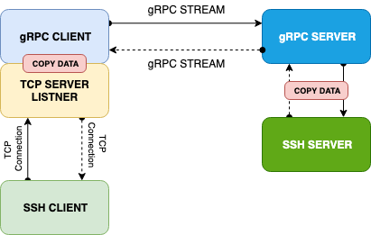

# gRPC Hijack SSH Tunnel

## Description
Small POC to have a starting point for a SSH connection done over gRPC.

## Architecture

## Usage

Short guideline:
- Use the `Vagrantfile` to create a Ubuntu based VM in VirtualBox if that will ease the suffering
- Use the `make` based filesystem
    - the `make` command will show you all the available target
    - use simply `make` and it will build the project
    - all artifacts will be available in the `./out` folder
- `make run_server` 
    - will execute the server in the background
    - logs will be available in the `./out` folder
- `make run_client` 
    - will execute the client in the foreground
